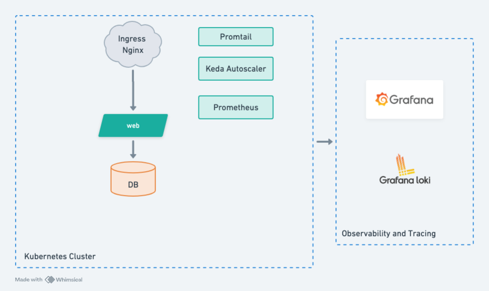

# hackathon

# The System Design

  
   

## SETUP INFA & DEPLOY
- folder GKE for deploying gke and components
- CI/CD pipeline for building and deploying sample-app 

## TODO
- Change public gke cluster to private gke cluster
- database should use outside k8s and setup replicaset for HA
- Setup KEDA autoscaler
- Setup Harbor as container registry service
- Implement canary deployment strategy
- Build helm repository